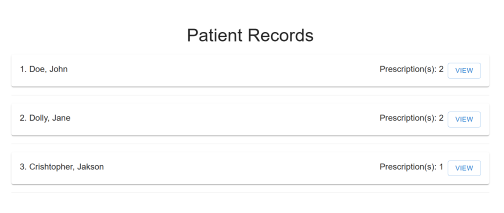
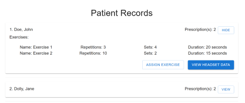
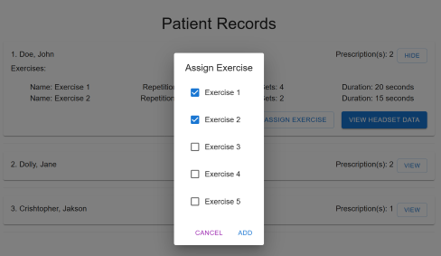
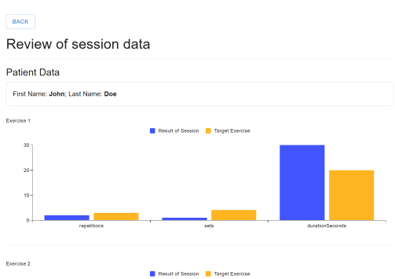

# Physiotherapy app
A small web application that you can use to assign exercises to a patient and review headset data sessions.

## Instructions
The project is divided into two main folders: **Backend** and **Frontend**. The backend is built with .NET Core 8.0, and the solution file for Visual Studio is included inside this folder. Run this project first to start the API. 

The frontend is created with Vite React @lastest version and uses React Material UI 7.0 for display elements. It relies on the API to function properly. Run ```npm install``` before running ```npm run dev```.

## Things that will improve the project
- [ ] For the Web API, for each endpoint that returns ALL data, a pagination system or at least a limit, in case the data returned is huge.
- [ ] Using React-Query instead of the fetch API for server communication. React-query has caching built in, so it will reduce needless calls to the server.
- [ ] Implement caching in the backend, no need to read new data for every endpoint call.
- [ ] Implementation of ADD, REMOVE and EDIT for patient data, as well as for the exercises.
- [ ] In the API, use AutoMapper for better conversion between Models and DTOs
- [ ] In the API, currently, there is no logging of things that went wrong. Implement _logger for each endpoint.
- [ ] Unit test for all of the Services, Endpoints, Repositories and Facades.
- [ ] Better responsive design for the React project.

## Usage
Once the first page is loaded, you will be presented with a list of patients.


Click the 'View' button to see the prescribed exercises for the specific patient.


Click the 'Assign' Button to assign or remove exercises.



Click the 'View headset data' to review headset sessions for that patient.


